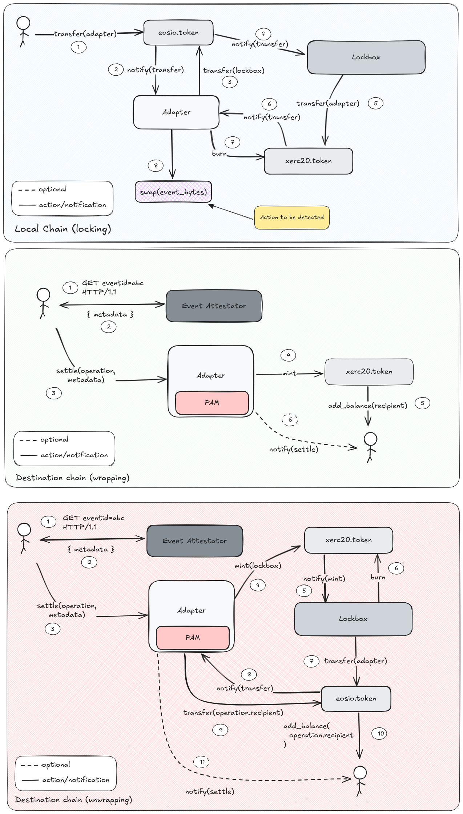

## AntelopeIO contracts

### Requirements

- [Eosio CDT 4.1.0](https://github.com/AntelopeIO/cdt/releases/download/v4.1.0/cdt_4.1.0-1_amd64.deb)
- Make (`apt install -y build-essential`)

If you want to spin up a local testnet:

- [Spring v1.0.2](https://github.com/AntelopeIO/spring/releases/tag/v1.0.2)

### Compile

```
yarn build
```

### Run the tests

Tests are based on the `vert` framework.

```
yarn test
```

**Note:** because of a bug in `vert` we are outputting the event bytes on the `swap` action of the adapter to
console output.

### Run the scripts

The scripts expects a local node running on the background, this is spinned up by the start-testnet.sh script (see requirements).
Check the scripts folder for further info, however here's a hint on how the tests would work:

```bash
cd scripts
./start-testnet.sh

# Swap
./eosio.token.sh user@active transfer user adapter "1.0000 WRAM" "user,0x0000000000000000000000000000000000000000000000000000000000000001,0xeb10e80D99655B51E3a981E888a73D0B21e21A6C,0"
```

### Design choices

#### XERC20

- We stick to eosio.token interface for XERC20
- New table (`bridges`) in order to map a set of issuers for a specific token

#### Lockbox

- When unlocking the local tokens stored in the vault by using the adapter.settle function, the final recipient is put in the `memo` field of the transfer, this due
  the transfer notification mechanism which from and to can't be througout the calls.

#### Adapter

- Operation's amount is an unsigned 128 bit integer, this is to support the 18 decimals values coming from the EVM networks. If the amount goes over the maximum allowed
  value, the least significat decimals are truncated after the operation has been validated.

### Data flow diagram

The following diagram should help the reader understand the possible flow of actions for crosschain operations.


