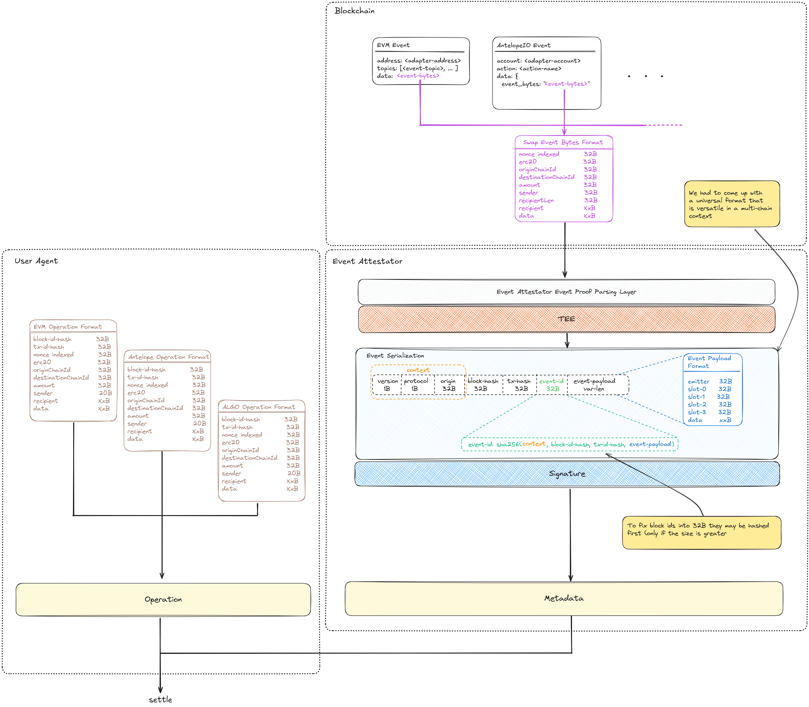

# Solidity contracts

## Important notes:

### Crosschain tradeoffs

- Recipient of the tokens are string, in order to manage other chains destinations
- The bytes32 type has been used on those entities (sender, chain ids) where there is no a standard representation crosschains. For instance on the EOS the sender can be an account name `'x.ptokens'`. As a general rule if the value is more than 32 bytes, w use the relative sha256 hash (this will be included into the pre-image when the signature of the event is generated).

### Fees

- Fees are taken when the asset is wrapped and unwrapped in order to not take them twice
- In spite of this, fees are deposited to a contract called `FeesManager` which is supposed to be deployed on the home(local) chain only

## Contracts

### Adapter

Facilitates user/dApp interaction with the XERC20. It exposes two functions and relative variations depending on the asset being swapped:

- `swap()`: initiate a crosschain transfer of an ERC20/XERC20 token to another chain. The event emitted includes an indexed nonce plus the bytes with the event payload included into a struct called EventBytes.
- `swapNative()`: initiate a crosschain transfer of the native currency to another chain
- `settle()`: finalize the operation created by the swap on the destaintion, it may result into an unwrap operation of the asset if the settlement is done on the home chain (where the lockbox has been deployed) or just a mint operation on the destination chain

This is the actual components used to bridge asset crosschains and it will have the minting/burning limits set in the pTokenV2/XERC20 contract.

### XERC20Lockbox

Vault where the collateral is being kept safe. Exposes the following functions and relative variations depending on the asset being deposited or withdrawn:

- deposit(): lock the ERC20 into the contract and mint the relative amount of XERC20 to msg.sender
- withdraw(): unlock the ERC20 from the contract and transfer them to the msg.sender

Other variations of the function handles when the asset in the native chain currency or if the asset is being deposited/withdrawn by a third party (`depositTo`/`withdrawTo`).

### XERC20

This reflect the XERC20 standard with modifications on the `_burnWithCaller` function, which
includes the logic to take the fees on the local chain. In addition the the adapter to PAM mapping has been added in order to give the token owner a way to change it.

### XERC20Registry

Keeps track of the ERC20 => XERC20 pairs in order for bridges to retrieve them easily. The Adapter contract expects the address of the registry upon deployment and
it uses the `getAssets(address)` function in order to retrieve the correct pair.

New entries can be added only by the owner of this contract and by the relevant ERC20 token owner. Similarly the same access control is applied for the deregistration of a pair from the registry.

When registering an XERC20 for the native currency (i.e. ETH) the zero address is used and this is the only exception

### PToken

First version of the PToken contract, which is not xERC20 based.

### PTokenNoGSN

First version of the PToken contract, which is not xERC20 based and does not include the Gas Station Network logic.

### PTokenV2

Newer version of the PToken contract which implements the xERC20 interface (the slightly changed version described above).

### PTokenV2NoGSN

Same as PTokenV2 but without the GSN logic.

### Data flow diagram

In order to give a high level overview of the main flow, we provide the following diagrams:


### Authorization system overview

The authorization system is deployed off-chain and is composed of

- A light client running on the pertinent blockchain which scans each transaction for the events of interest
- A decoding layer, which algorithm depends on the origin chain where the event was emitted (i.e. `abi.decode` for EVM like chains)
- A logic which extracts the event bytes of interest (a concatenation of the token being swapped, the sender, recipinet etc...)
- A logic which signs a series of data:
  - context: where is defined the protocol id and the version of the current event format
  - block and transaction hash containing the event
  - the event bytes extracted after decoding the event

Please see the following diagram as a reference:



### Run the tests

Tests suites are divided into

- `hardhat/`: which includes units and forked environment tests
- `forge/`: which includes integration and e2e tests

In order to run them you need to have `yarn` installed and then run:

```
yarn install
yarn test
```

### Generate the coverage report

```
yarn coverage
```

To see each score, open the `lcov/index.html` file.
