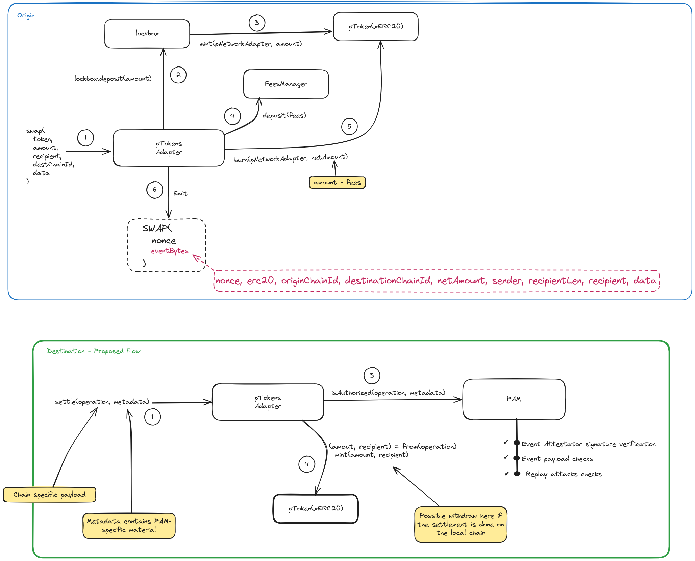

## Solidity contracts

Here are the contracts related to EVM deployments. Everything contract's related can be found in the `src` folders.
Tests can be found in the `test` folder divided into `hardhat` and `forge` tests. Both frameworks were used in order
to leverage the best features of both depending on the test to be performed.

### Compile

Just run

```
yarn install
yarn build
```

### Run the tests

Tests suites are divided into

- `hardhat/`: which includes units and forked environment tests
- `forge/`: which includes integration and e2e tests

In order to run them you need to have `yarn` installed and then run:

```
yarn install
yarn test
```

### Generate the coverage report

```
yarn coverage
```

To see the score, open the `lcov/index.html` file in the broswer.

### Design notes:

#### Crosschain tradeoffs

- There is a `isNative` flag on the Adapter contract in order to mark the distinction of the native currency and an xERC20 deployed on a non-local chain.
- Recipient of the tokens are string, in order to manage other chains destinations
- The `bytes32` type has been used on those entities (sender, chain ids) where there is no a standard representation among blockchains. For instance on the EOS the sender can be an account name `'x.ptokens'`. As a general rule if the value is more than 32 bytes then use the relative `sha256` hash (this will be included into the pre-image when the signature of the event is generated).

#### Fees

- Fees are taken when the asset is wrapped and unwrapped in order to not take them twice
- Consequently, fees are deposited to a contract called `FeesManager` which is supposed to be deployed on the local chain only.

### Data flow diagram

In order to give a high level overview of the main flow, we provide the following diagrams:


